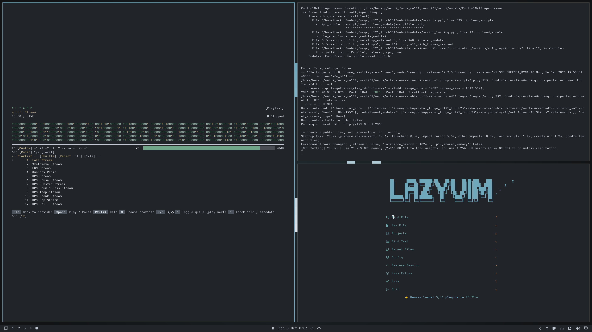
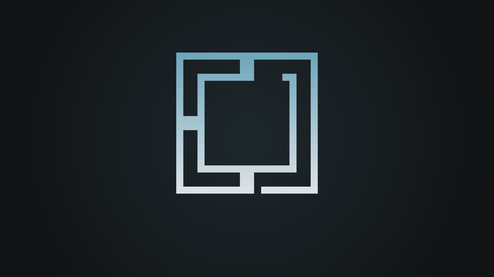

# Omarchy Pixel Effect

https://github.com/user-attachments/assets/dc08b0e3-058e-4394-b520-de8e56606a9b

This plugin adds a **SUPER+SPACE menu pixel wipe** and the **omakase-pixel** palette theme for
[Omarchy](https://omarchy.org/) — the Arch/Hyprland distro.

Open the menu with **SUPER + SPACE**: instead of a plain fade, the card emerges
from behind a leading row of shimmering pixels that rolls top-to-bottom over
~620 ms with two twinkling "tail" rows above it — the same value-noise family as
the pixel field on [omarchy.org](https://omarchy.org/).

## Preview

| Desktop | Wallpaper — wordmark | Wallpaper — symbol |
| :---: | :---: | :---: |
|  |  |  |

This repo ships exactly three things, and nothing else:

| Directory              | What it is                                                                 |
| ---------------------- | -------------------------------------------------------------------------- |
| `omakase-pixel/`       | The **palette theme** — `colors.toml` (25-key source of truth), the derived 6-color `pixel_palette.toml` the FX read, `shell.lock.toml` (hyprlock colors), `icons.theme`, a 4K wallpaper, and previews. |
| `omakase-pixel.menu/`  | The **SUPER+SPACE menu plugin** (a Quickshell `menu` + `bar-widget`) with the pixel wipe and the app-list fallback. |
| `omakase-pixel.lock/`  | The **lock-screen plugin** (a Quickshell `service`, `clonedFrom: omarchy.lock`) with the shimmering pixel border around the screen edge. `Service.qml` is a byte-identical copy of stock — auth logic untouched; only `LockView.qml` gains the border. |

The Pixel Fade effect works on any theme but it was specifically built around the color palette of the included omakase-pixel theme.

---

## Requirements

- **Omarchy 4.0.x** (built and tested on `4.0.4`). The menu's app-list fallback
  is what you actually want on 4.0.4+ — see *Why the fallback exists* below.
- `jq` (used to patch `shell.json` safely). Install with `sudo pacman -S jq`.
- `git`, and an [XDG] set of app `.desktop` files (any normal Omarchy install has these).

Everything this installs lives under your `$HOME` — **no `sudo`, nothing written
outside `~/.config/omarchy/`**.

---

## Install

```sh
git clone https://github.com/Signal-Six/Omarchy-Pixel-Effect.git
cd Omarchy-Pixel-Effect
./install.sh
```

That installs **both** pieces:

1. Copies `omakase-pixel/` → `~/.config/omarchy/themes/omakase-pixel/` and applies
   it with `omarchy theme set omakase-pixel` (palette, wallpaper, lock-screen colors).
2. Copies `omakase-pixel.menu/` → `~/.config/omarchy/plugins/omakase-pixel.menu/`
   (backing up anything already at that path), then patches `~/.config/omarchy/shell.json`:
   the bar's left menu slot now names `omakase-pixel.menu`, and `omarchy.menu` /
   `hyperlayer.menu` are added to `disabledPlugins` so they don't double-render.
3. Restarts the omarchy shell so the new plugin loads.

Press **SUPER + SPACE**. The card should reveal with the pixel wipe.

> **Why not `omarchy theme install <url>`?** That command clones the *whole repo*
> to `~/.config/omarchy/themes/<name>` and stages the **repo root** as a single
> theme, deriving the theme name from the repository basename (which would become
> `pixel-effect`, and it would also try to install the menu plugin as if it were
> theme color). This repo is a two-part bundle, so it ships its own `install.sh`.

### Options

```sh
./install.sh             # theme + menu + lock (default)
./install.sh --theme     # palette theme only
./install.sh --plugin    # SUPER+SPACE menu only
./install.sh --lock      # lock screen only
./install.sh --uninstall # remove all three, restore the previous shell.json
./install.sh --no-restart# skip the final shell restart
./install.sh --help
```

### Uninstall

```sh
./install.sh --uninstall
```

Removes the theme dir and the plugin, restores the pre-install `shell.json`
snapshot (or, if the snapshot is gone, strips our bar entry and re-enables the
stock menu), and restarts the shell. If `omakase-pixel` was your active theme,
pick another afterwards: `omarchy theme list`.

---

## What you get

### The palette (`omakase-pixel`)

A darker, cooler (blue, not green) take on stock **gruvbox**. `colors.toml` is
the single source of truth; the animated FX never hard-code colors — they read a
6-color ladder **derived** from it in `pixel_palette.toml`:

| key      | value    | role                                    |
| -------- | -------- | --------------------------------------- |
| `bg`     | `#111315`| card / field background                 |
| `dim`    | `#374e57`| faintest lit pixel                      |
| `mid`    | `#4e7381`| mid-tone lit pixel                      |
| `lit`    | `#6fa7bb`| the accent (`accent`/`blue` in `colors.toml`) |
| `hover`  | `#abc7d3`| bright / hovered cell                   |
| `crest`  | `#dce1e7`| brightest cell / wordmark crest         |

Key `colors.toml` values: `background #212429` · `darker_background #111315` ·
`accent #6fa7bb` · `foreground #c0c7d0` · `bright_foreground #dce1e7`.

### The menu pixel wipe (`omakase-pixel.menu`)

A fork of the stock `omarchy.menu` plugin with two additions:

- **The pixel wipe.** A `Canvas` (z above
  the card contents, clipped to the card's rounded corners) covers the lower part of
  the card with the card background plus faint noise specks, and a leading row of
  shimmering lit cells rolls top→bottom over ~620 ms (OutCubic) with two twinkling
  "tail" rows above it. The panel waits for `rowsLoaded` before appearing, so the
  wipe **leads** the content instead of revealing an empty card.
  - **Opt out of motion** (instant card, no wipe): the wipe reads
    `OMARCHY_PIXEL_WIPE`; set it to `0` and the card appears instantly. The shell
    inherits its env from `omarchy-launch-shell`, and `~/.local/bin` precedes
    `/usr/share/omarchy/bin` on `PATH`, so shadow the launcher with a one-line
    wrapper:
    ```sh
    mkdir -p ~/.local/bin
    cat > ~/.local/bin/omarchy-launch-shell <<'EOF'
    #!/usr/bin/env bash
    export OMARCHY_PIXEL_WIPE=0
    exec /usr/share/omarchy/bin/omarchy-launch-shell "$@"
    EOF
    chmod +x ~/.local/bin/omarchy-launch-shell
    ```
    then `omarchy restart shell`. To undo, delete the wrapper. (The wipe is
    deliberately *not* wired to `StyleHints.reduceAnimations`, which this file
    does not import and not every build exposes.)
- **App-list fallback with icons.** On Omarchy **4.0.4+** the host withholds
  `shell.appLibrary` from third-party `menu`-kind plugins, so a menu that relied on
  it shows an **empty Applications list**. This plugin carries a bash `.desktop`
  fallback as the primary path when `appLibrary` is absent (and the real
  `appLibrary` when present). Unlike a bare fallback, every row carries a **resolved
  icon path** (`iconPath`), so app icons survive the missing library. Launch goes
  through `uwsm-app -- gtk-launch <id>.desktop`, keeping the `.desktop` file the
  source of truth for the real command.
  - **Icon resolution** follows your *active* icon theme through its `index.theme`
    `Inherits=` chain, then `hicolor`/`Adwaita`; scalable SVGs are preferred, then
    128/48/32/24 px PNGs. Apps with genuinely missing icon files may render iconless but are never broken.

### Why the fallback exists (the two bugs it fixes)

Other theme plugins (this idea was heavily inspired by [Pierre-Aoki's Netrunner](https://github.com/Pierre-Aoki/omarchy-netrunner-theme) theme plugin) carried a custom SUPER+SPACE menu that relied
solely on `shell.appLibrary`. On 4.0.4+ that broke in two ways:

1. **Missing app list** — no `appLibrary` means no rows at all.
2. **Duplicate rows** — the merge code wrote *in place* into a QML `var` map; a
   write the engine dropped left an id in `itemOrder` with no item, and the next
   rescan re-appended a second row for the same app, compounding on every rescan.

This plugin was forked from the *stock* menu and written with the fallback built in
from the ground up: the bash `.desktop` scanner dedupes by basename (first dir wins,
like XDG precedence) and skips `Hidden`/`NoDisplay`/`OnlyShowIn`/unnamed entries, and
the merge helpers (`mergeAppRows` / `swapProviderRows`) return **fresh**
`items`/`itemOrder` objects and drop orphan ids — so a single lost write can never
compound into a duplicate.

---

## Repository layout

```
Omarchy-Pixel-Effect/
├── install.sh                 # installs theme + plugin (see above)
├── README.md
├── omakase-pixel/             # the palette theme
│   ├── colors.toml            #   25-key source of truth
│   ├── pixel_palette.toml     #   derived 6-color FX ladder
│   ├── shell.lock.toml        #   hyprlock colors
│   ├── icons.theme            #   icon theme (Yaru-blue-dark)
│   ├── backgrounds/wallpaper2.png #  4K wordmark wallpaper (light→blue gradient)
│   ├── backgrounds/wallpaper3.png #  4K symbol wallpaper (same gradient + glow)
│   ├── wallpaper.png          #   theme-picker wallpaper (original, flat)
│   ├── preview.png            #   theme-picker preview (wordmark, gradient)
│   ├── preview-symbol.png     #   theme-picker preview (symbol, gradient)
│   ├── preview-desktop.png    #   4K desktop screenshot (README preview)
│   ├── preview-unlock.png
│   └── unlock.png
├── omakase-pixel.menu/        # the SUPER+SPACE menu plugin
│   ├── manifest.json          #   id: omakase-pixel.menu, clonedFrom: omarchy.menu
│   ├── Menu.qml               #   the wipe Canvas + card + app fallback
│   ├── MenuModel.js           #   JSONC parsing, search, guard batching
│   └── BarWidget.qml          #   the bar's menu button
└── omakase-pixel.lock/        # the lock-screen plugin (pixel border)
    ├── manifest.json          #   id: omakase-pixel.lock, clonedFrom: omarchy.lock
    ├── Service.qml            #   stock service (auth untouched)
    └── LockView.qml           #   stock lock view + shimmering pixel border
```
---

## Customizing

- **Change colors.** Edit `omakase-pixel/colors.toml` (the 25-key source of truth),
  then regenerate the 6-color ladder `pixel_palette.toml` to keep the FX in sync,
  and re-apply: `omarchy theme set omakase-pixel`. The wipe always reads the
  theme's `Commons.Color.menu.background` / `Commons.Color.menu.text`, so
  recoloring the theme recolors the wipe for free.
- **Menu speed / cell size.** In `omakase-pixel.menu/Menu.qml`, the `pixelWipe`
  `Canvas` carries `duration` (ms), the cell size `cs`, and `reduced`.
- **Menu items.** The menu reads the stock JSONC at
  `~/.config/omarchy/extensions/omarchy-menu.jsonc` and the Omarchy defaults —
  this plugin does not fork those; you edit them as normal and they hot-reload.

## Troubleshooting

| Symptom | Fix |
| ------- | --- |
| SUPER+SPACE does nothing | The shell may not have loaded the plugin yet: `omarchy restart shell`, then try again. Check the bar's left menu slot names `omakase-pixel.menu`. |
| Empty Applications list | You're on a host that *does* expose `appLibrary` to this plugin (pre-4.0.4 or a first-party build). The menu then uses `appLibrary`; if it's still empty, confirm `.desktop` files exist under the XDG `applications` dirs. |
| Some apps show no icon | Their icon file is genuinely missing from your icon theme; they render iconless by design. |
| Menu didn't pick up my shell.json edits | `shell.json` hot-reloads, but the *plugin swap* needs a shell restart: `omarchy restart shell`. |
| `jq` not found | `sudo pacman -S jq`. |
| Menu opens black / empty over a frozen screen | Qt 6.12 ships a built-in `Color` singleton in QtQuick that shadows the shell's palette. This suite qualifies all palette reads as `Commons.Color.*` (see `import qs.Commons as Commons`); re-run `install.sh` if an old copy is installed. |

---

## License

MIT. Palette derived from the gruvbox family; pixel-field value-noise algorithm
ported from the [omarchy.org](https://omarchy.org/) hero banner.
